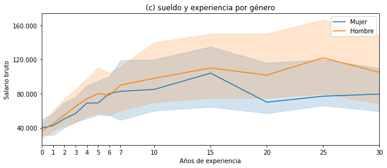
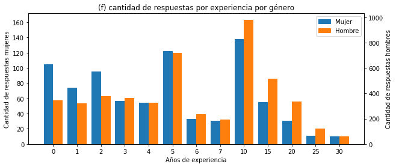
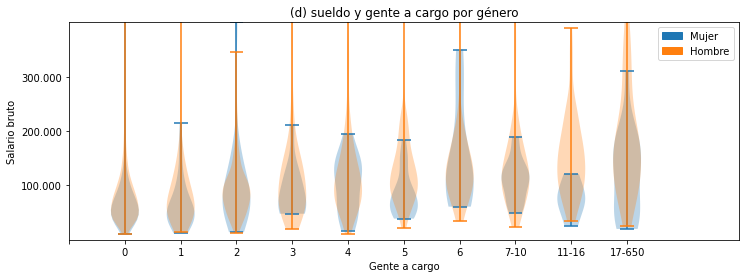
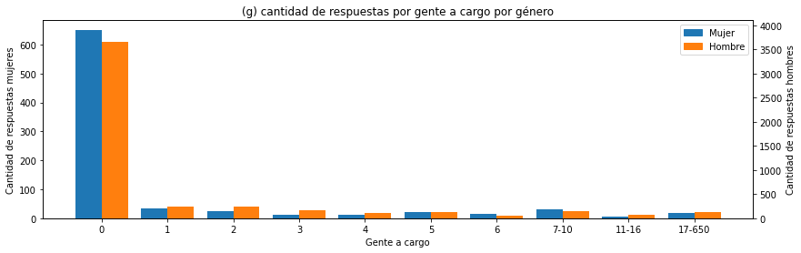
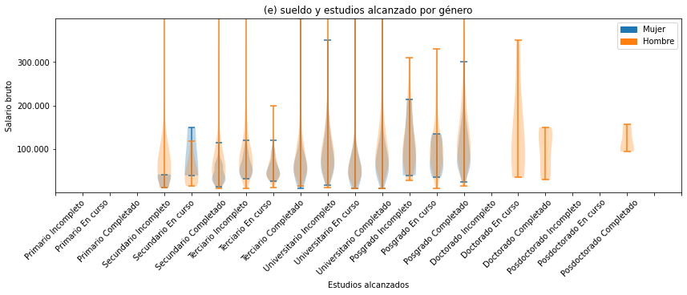
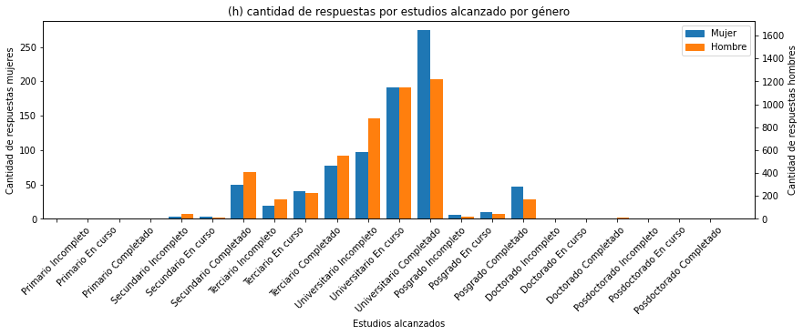

# Brecha de género

Si jugamos un poco con [el predictor de
sueldos](https://seppo0010.github.io/sysarmy-sueldos-2020.1/) vemos que cambiar
el género de "hombre" a "mujer" suele llevar aparejada una disminución del
sueldo.

Una aclaración que cabe hacer es que cada evaluación toma en cuenta todas las
características en conjunto y no puede extraerse el valor de una
independientemente de las demás, al menos no en este modelo. Es decir, podrían existir casos puntuales en los que 
el sueldo suba al hacer ese cambio, pero no podemos afirmar, _a priori_,
cuánto es el efecto en general.

Todos los cálculos lo pueden encontrar en [este jupyter
notebook](https://github.com/seppo0010/sysarmy-sueldos-2020.1/blob/master/notebook/Brecha%20de%20g%C3%A9nero.ipynb)

## Medir la brecha

[

Ver detalles
](overall.md)

Si miramos la distribución de sueldo por género (gráfico (a)) parecería mostrar un sueldo más alto para hombres. Pero es
difícil hacer una buena comparación "a ojo". Una mejor opción es comparar los valores de la mediana de cada grupo. 
En estadística, la mediana es el valor del dato que está en la posición central y deja la misma cantidad de datos a uno y otro lado. 
Por ejemplo, si tuviéramos 11 datos de sueldo y los ordenáramos de menor a mayor, la mediana correspondería al sueldo de la posición número 6 porque quedarían 5 sueldos a un lado (las posiciones 1, 2, 3, 4 y 5) y 5 sueldos al otro (las posiciones 7, 8, 9, 10 y 11).
En este caso, tenemos 820 datos de mujeres. Como es un número par, si las ordenamos por sueldo, la mediana de sueldo corresponderá al valor del promedio de los sueldos de las mujeres en las posiciones 410 y 411. Este valor es $62.050.
En el caso de los hombres, tenemos 4922 datos. Por lo tanto, la mediana de sueldo corresponderá al valor del promedio de los sueldos de los hombres en las posiciones 2461 y 2462. Este valor es $77.000.
Al compararlas, vemos que se obtiene una 
diferencia de un 20% a favor de los hombres. Es decir, que las mujeres cobran 80 centavos por cada peso que se le paga a los hombres. Este valor es lo que se conoce habitualmente como _unadjusted gender pay gap_ (GPG), es decir brecha salarial de género sin ajustar.

### Brecha ajustada

Ahora bien, ¿podemos atribuir estas discrepancias exclusivamente a diferencias de género o hay otros factores que influyen y no somos capaces de distinguir al comparar medianas? Efectivamente, el indicador GPG es complejo y, aunque proporciona una idea general de la diferencia entre los salarios de hombres y mujeres, no tiene en cuenta que esta diferencia se puede atribuir no solo a la discriminación directa ('salario desigual por igual trabajo'), sino que también se relaciona con muchos otros factores, incluidos los concentración de un género en ciertas actividades ('segregación'), la facilidad de acceso a puestos jerárquicos mejor pagados ('techo de cristal'), la experiencia laboral total, las habilidades desarrolladas y el número de horas de trabajo.
En ese sentido, es posible tratar de descomponer el GPG en diversas contribuciones para _ajustar_ la brecha y conocer mejor sus componentes. Existen diferentes propuestas acerca de cómo hacerlo. Aquí vamos a postular una a partir de nuestro modelo.

¿Cómo podríamos intentar estimar si existen diferencias exclusivamente por género? 
Una manera sería aprovechar los datos que tenemos y pedirle al modelo que haga una predicción del sueldo para todos esos datos conocidos pero invirtiendo el género. 
De esta manera, podríamos saber cuánto cree el modelo que debe pagar en cada caso manteniendo todas las variables iguales (educación, experiencia, etc.) excepto género.
El resultado de este análisis se muestra en el gráfico (b) y arroja una mediana de sueldo para mujeres de $74.243 y para hombres de $80.492.

[

Ver detalles
](salary-estimate.md)

La diferencia entre las nuevas medianas estimadas es de un 7,71% del sueldo de
los hombres o, dicho de otra manera, el modelo aprendió que le tiene que pagar a
las mujeres 92 centavos por cada peso que le paga a un hombre que hace el
mismo trabajo. Y en este caso, sí, podemos saber que la discrepancia se debe
exclusivamente a la variable "género". Es el componente de discriminación directa o explícita, lo que llamaríamos _adjusted GPG_ o brecha salarial ajustada.

### Brecha no ajustada

#### Distribución de sueldo por género

Como ya mencionamos, parte de la brecha no se debe a discriminación explícita hacia dos
personas que hacen el mismo trabajo, sino a decisiones o circunstancias que
afectan el trabajo y no son iguales para hombres y mujeres.

Para establecer el sueldo, el modelo de predicción toma como características principales a la experiencia, la cantidad de personas a cargo y el nivel educativo, en particular, si esa persona fue a la universidad y la completó. Veamos cómo es la variación de cada una de estas
características según el género.

Es importante mencionar que no alcanza sólo con ver la distribución de los datos sino que, también, tenemos que tener en cuenta
la cantidad de respuestas en cada grupo. Si hubiese una diferencia de sueldo
grande en un grupo en el que hay pocas personas, su repercusión sobre la
brecha total no sería significativa. Por lo tanto, analizaremos ambas variables en cada caso.

##### Experiencia
La experiencia, el principal predictor del sueldo, tiene una relación en general
positiva con el sueldo (es decir, a mayor experiencia, mayor remuneración) como
se ve en la figura (c). Sin embargo, a medida que aumenta la experiencia, se observa cómo la
brecha entre hombres y mujeres se incrementa. A su vez, en el gráfico (d) vemos que hay menos cantidad de mujeres con 10 o más años de experiencia.
Dado que la brecha se agranda en este rango y, además, esta característica es la principal predictora del sueldo, la
contribución a la brecha total explicada por esta variable es significativa.

[

Ver detalles
](experience.md)

[

Ver detalles
](experience.md)

##### Número de personas a cargo
En cuanto al número de personas a cargo (gráfico (e)), no se ve una diferencia sustancial cuando las cantidades son pequeñas, pero esta
diferencia es mayor al pasar las 7 personas. De todas formas, al analizar la cantidad de respuestas para cada rango (gráfico (f)) vemos cómo la gran mayoría de las personas no tienen a nadie a cargo y las diferencias en otros grupos no parecen significativas. Por lo tanto, podríamos pensar que la contribución a la bercha no ajustada no es significativa.

[

Ver detalles
](inchargeof.md)

[

Ver detalles
](inchargeof.md)

##### Nivel de estudio
Para cada nivel de estudio vemos que la distribución de ingresos de los hombres
es igual o superior a la de las mujeres. Esto se manifiesta en el gráfico (g) en la comparación de las áreas: el área naranja está superpuesta o por encima de la azul en todos los casos. La única excepción es en la categoría "Secundario en curso". Sin embargo, nuevamente, el número limitado de datos (sólo hay tres mujeres en esa categoría tal como se ve en el gráfico (h)) hace difícil poder obtener una conclusión al respecto y, además, su influencia a la brecha total es muy baja.
Un detalle relevante es que aún cuando, proporcionalmente, son más las mujeres con estudios universitarios completos o superiores, la
distribución de sueldos en todos los niveles favorece a los hombres.

[

Ver detalles
](study.md)

[

Ver detalles
](study.md)

