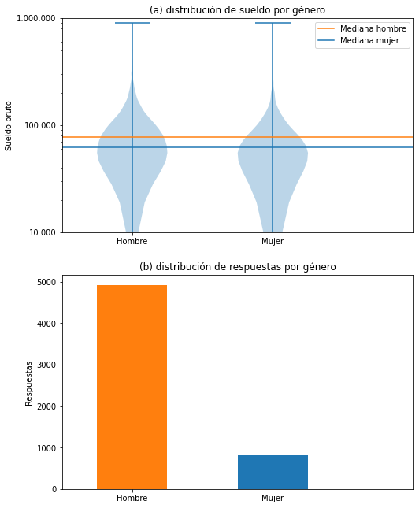
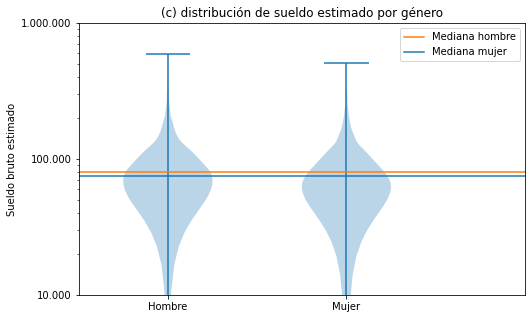
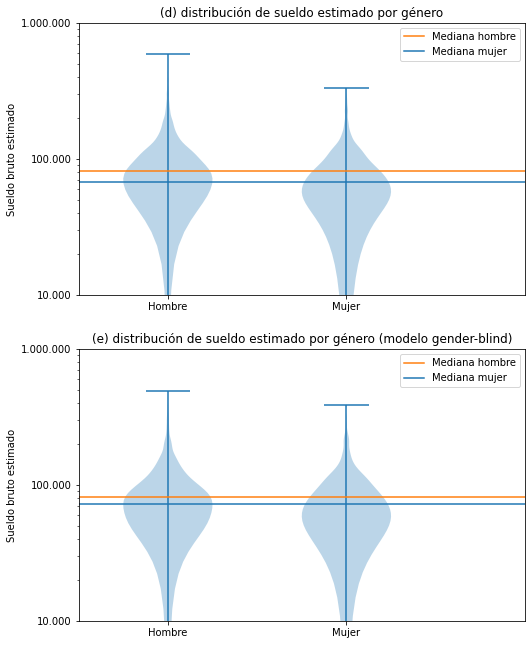

# Brecha de género

Jugando un poco con [el predictor de
sueldos](https://seppo0010.github.io/sysarmy-sueldos-2020.1/) vemos que cambiar
el género de "hombre" a "mujer" suele llevar aparejada una disminución del
sueldo.

Una aclaración que cabe hacer es que cada evaluación toma en cuenta todas las
características en conjunto y no puede extraerse el valor de una
independientemente de las demás, al menos no este modelo. Es decir que pueden
haber casos donde el sueldo suba al hacer ese cambio, y que no podemos afirmar
cuánto es el efecto en general.

## Medir la brecha

[

Ver detalles
](overall.md)

La mediana es el valor que deja la misma cantidad de gente de los dos lados.
Por ejemplo, habiendo 820 respuestas de mujeres, sería el sueldo de la mujer
número 410 al ordenarlas por sueldo.

La distribución, a ojo, parece mostrar un sueldo más alto para hombres. Es
difícil compararla bien, pero tomemos la mediana de cada grupo. Ahí la
diferencia es de un 20% en favor a los hombres.

Esta simplificación no considera otras características que puedan afectar el
sueldo, como la experiencia, las habilidades o las tareas.

Otra forma de medir la brecha puede ser ver la diferencia de sueldos que ofrece
el modelo de predicción entre hombres y mujeres. Podemos pedirle que estime
el sueldo para todos los datos conocidos, pero invirtiendo el género, y así
medir cuánto cree que debe cambiar.

[

Ver detalles
](salary-estimate.md)

La diferencia entre las medianas estimadas es de un 7,71% del sueldo de los
hombres, o dicho de otra manera, el modelo aprendió que le tiene que pagar a
las mujeres 92 centavos por cada peso que le paga a un hombre que hace el
mismo trabajo.

## Eliminar el género

Una pregunta que parece obvia es por qué incluímos el género si no creemos que
por sí mismo sea un diferenciador válido para el sueldo. Lo mismo se puede
decir de orientación sexual y edad, categorías prohíbidas según la
[ley 23.592](http://servicios.infoleg.gob.ar/infolegInternet/anexos/20000-24999/20465/texact.htm),
[Convención Americana Sobre Derechos Humanos](http://servicios.infoleg.gob.ar/infolegInternet/anexos/25000-29999/28152/norma.htm),
[el caso Atala Riffo y Niñas Vs. Chile](http://www.corteidh.or.cr/cf/jurisprudencia2/ficha_tecnica.cfm?nId_Ficha=196&lang=es).

Podemos entonces crear un modelo que ignore estas tres características y ver
cómo afecta a los hombres y mujeres en cuanto a su sueldo estimado. No podemos,
como hicimos antes, comparar el mismo registro para hombre y mujer porque el
modelo ignora esta característica, pero sí podemos compararlo con la decisión
que había tomado para hombres y para mujeres el modelo anterior.

En este caso no podemos comparar el sueldo que el modelo le asigna a hombres y
mujeres directamente porque el modelo ignora esta característica, así que
lo que podemos hacer es ver los hombres y mujeres en los datos originales
cuánto se vieron beneficiados o perjudicados por este modelo en contraste con
el anterior.

[

Ver detalles
](salary-estimate-gender-blind.md)

Los hombres disminuyen sus ingresos un 0.3%, mientras que las mujeres lo
mejoran en un 6.3%. Con esto la brecha persiste pero casi se elimina.
