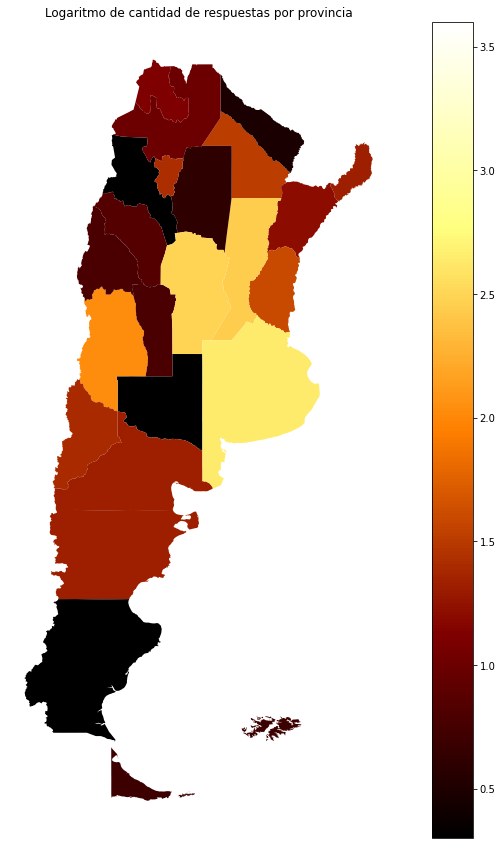
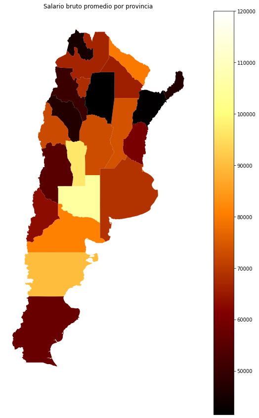
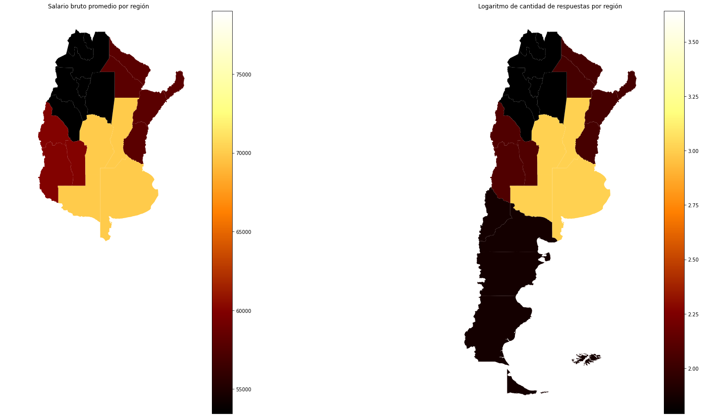

# Predicción de sueldo

Vamos a ver cómo crear un modelo de _machine learning_ que pueda determinar el
sueldo de una persona según información personal y laboral. El código está
disponible en
[github](https://github.com/seppo0010/sysarmy-sueldos-2020.1/blob/master/notebook/Predicci%C3%B3n%20de%20sueldo.ipynb),
en este texto vamos a exponer el razonamiento y explicar las técnicas
utilizadas.

## Qué es un modelo

Un modelo busca representar matemáticamente relaciones entre entidades para
estudiar su comportamiento. En este caso en particular vamos a ver cómo desde
información de una persona, como su género, edad, años de experiencia,
y de su trabajo, como cantidad de empleados, rubro, podemos infererir, con
cierto grado de precisión, su sueldo.

## Qué es un modelo de machine learning

_Machine learning_ (o aprendizaje automático) es ordenarle a una computadora
que aprenda a inferir dándole datos. En general una persona puede hacer modelos
con los parámetros que quiera, pero dentro de este área en particular sus
valores son determinados automáticamente.

## Metodología

A continuación desarrollaremos paso a paso dos modelos, pero antes de pasar a
eso vamos a hacer un breve análisis de los datos, y también determinar cómo
vamos a evaluar a los modelos, ya que queremos saber cuán bueno es reflejando
la realidad.

Para cada modelo lo primero que tenemos que hacer es determinar qué
_arquitectura_ va a usar, por ejemplo si va a seguir una fórmula matemática qué
forma va a tener ésta. Después hay que procesar los datos de alguna forma para
que el modelo pueda usarlos; esto va a depender de la arquitectura. Y por
último vamos a evaluarlos.

## Origen de datos

La información que vamos a usar como base es la [encuesta de sueldos de sysarmy
2020.1](https://sysarmy.com/blog/posts/resultados-de-la-encuesta-de-sueldos-2020-1/).
Esta encuesta se realiza cada seis meses anónimamente y luego los microdatos
(cada respuesta recibida) son publicados. Las respuestas corresponden al
período 9/12/2019 - 3/2/2020, y corresponden a 5.982 personas.

Para obtener información sysarmy crea un formulario y publica el link en
redes sociales y grupos de usuarios de tecnologías relacionadas. Por ello hay
que considerar que las respuestas son de una población _autoseleccionada_, y
por lo tanto no representan a toda la población de IT de Argentina. Cada vez
que lleguemos a una conclusión tenemos que tener en cuenta que no se puede
generalizar sino que como mucho se puede apreciar una tendencia.

También tenemos que tener cuidado con la calidad de la información. Como el
formulario es abierto para que cualquier persona ingrese los datos que quiera,
no se puede estar seguro de la calidad de los mismos. Por ejemplo en esta
edición alguien respondió que tiene 1.555.555.555.555.555.555.555.555 empleados
a cargo, un número claramente exagerado. Sin embargo puede haber otros casos
donde no se detecten tan fácilmente los problemas, o incluso que la información
sea verosímil y no sea posible de diferenciar.

Los datos corresponden a los meses de diciembre de 2019 y de enero de 2020
en Argentina, meses en los cuales la inflación fue de
[3,7% y 2,3%](https://www.indec.gob.ar/uploads/informesdeprensa/ipc_06_201F5D8F36A1.pdf)
respectivamente. Esto puede traer variabilidad en los números porque no tenemos
la fecha de cada registro para normalizar los valores si hubo ajustes de
sueldo.

## Detección de anomalías

El primer paso, considerando el origen de los datos, va a ser "limpiar" la
información. Queremos eliminar valores extremos que nunca serían posibles,
números que un humano encuestando no hubiese aceptado. Para eso podemos
graficar cada columna y buscar números que no tengan sentido.

Un par de ejemplos:

En el gráfico (a) vemos que alguien respondió que ganaba alrededor de
$7.000.000.000.000 de pesos por mes. Si eliminamos ese dato, que claramente no
es válido, obtenemos el gráfico (b). Pero, además, vemos que muchas otras
personas pusieron que ganaban $1, quizás personas desempleadas que igual
querían participar de la encuesta (gráfico (c)). Si también eliminamos esos
valores, entonces obtenemos el gráfico (d).

Por otra parte, en el gráfico (e) una persona puso que tenía alrededor de 2000
años en la misma empresa, probablemente alguien que malinterpretó la pregunta
como desde qué año estaba en la empresa actual. Si eliminamos ese dato,
obtenemos el gráfico (f).

Una vez hecha esta "limpieza", tenemos los datos con los cuales vamos a
trabajar para construir nuestro modelo.

## Criterio de evaluación

Los modelos tienen dos etapas, una de entrenamiento y una de predicción. En la
primera reciben datos con sus _etiquetas_ que representan el resultado correcto,
mientras que al predecir el resultado correcto es desconocido y tienen que
declarar su _opinión_. Sería muy sencillo hacer un modelo que memorice las
respuestas correctas y las responda siempre que se les pregunte por una de
ellas, pero este modelo tendría poca capacidad de predicción si sólo hiciese
eso, pese a poder predecir perfectamente estos valores.

Entonces lo que necesitamos es entrenar con un conjunto de datos y evaluar
otro. Como los datos que tenemos son relativamente pocos, vamos a utilizar
una técnica denominada [validación
cruzada](https://es.wikipedia.org/wiki/Validaci%C3%B3n_cruzada) (o _cross
validation_), que consiste en dividir los datos en varios grupos y entrenar el
modelo varias veces, en cada una excluyendo un grupo del entrenamiento pero sí
usarlo para evaluación. De esta forma, si hacemos validación cruzada con cinco
grupos vamos a entrenar cinco modelos diferentes, cada uno con cuatro quintas
partes de los datos, y éste puede intentar inferir la restante.

Entonces vamos a tener una predicción para cada valor, alcanzada por el modelo
que no vio ese dato al entrenarse. Una vez disponibles las predicciones
queremos saber cuán cercanas al resultado correcto eran. Para eso podemos
calcular un [coeficiente de
determinación](https://es.wikipedia.org/wiki/Coeficiente_de_determinaci%C3%B3n)
(o r2) que nos va a decir la proporción del error. Por ejemplo si una persona
gana $100 y el modelo estima $110 y para otra que gana $200 dice $180, su
coeficiente es de 0.9, porque tiene un 10% de error en cada estimación. El
mejor puntaje posible es 1 cuando todas las predicciones fueron aciertos.

### Modelo base

#### Elegir arquitectura

[Basado en trabajo
previo](https://github.com/seppo0010/sysarmy-sueldos-2019.1/blob/master/notebook/Sysarmy%20-%20Predicci%C3%B3n%20de%20sueldos.ipynb),
sabemos que hay tres características que son buenas predictoras del sueldo:
el género, la provincia en que trabaja y cuántos años de experiencia tiene una
persona. Entonces un modelo sencillo que podemos construir, consiste en tomar
en cuenta sólo estas características, y tratar de ubicar la línea recta que más
cerca pase de los puntos, o sea, armar un modelo de [regresión
lineal](https://es.wikipedia.org/wiki/Regresi%C3%B3n_lineal).

#### Preparar los datos

Para usar este modelo tenemos que llevar cada característica a un espacio
lineal. Que el espacio sea lineal significa que se puede medir la distancia
entre dos puntos y que esa misma distancia tendrá el mismo valor en otro lugar de la escala.

Tenemos datos de dos tipos: numéricos (la experiencia y el sueldo), es decir que
podríamos directamente operar con ellos, y no numéricos (el género y la
provincia), a los que vamos a tener que transformar en números de alguna manera.

##### Datos numéricos

En cuanto a la experiencia, si bien ya tenemos números con los que podemos hacer
cuentas, podríamos pensar que no es lo mismo para el sueldo pasar de no tener
experiencia a tener 1 año, que de tener 10 a 11. La diferencia parece ser
decreciente, es decir que mientras más años de experiencia tenga una persona,
menos le va a significar, en el sueldo, la adición de uno nuevo.

.

Una buena manera de ajustar este comportamiento es usando una función
logarítmica porque nos permite transformar un número en otro manteniendo el
orden pero achicando la distancia con el siguiente a medida de que el número se
hace mayor. En el gráfico (g) vemos como el valor correspondiente a 1 está más
lejos del de 0 que el correspondiente al 7 respecto del de 6.

También podrímos aplicar logaritmo al salario porque no es lo mismo ganar $1.000
más para alguien que gana $10.000 que una persona que cobra $200.000.

##### Datos categóricos en modelo lineal

En el caso de la provincia, podríamos asignarle a cada persona el sueldo
promedio de su provincia. Tenemos que tener en cuenta que cuando recibamos
datos para estimar no vamos a saber su sueldo, pero podemos usar el promedio
que calculamos de la provincia como un indicador de los salarios de ésta.
Es decir que si el salario promedio de la Provincia de Buenos Aires y el de
Santa Fe es parecido la provincia va a aportarle un valor cercano, mientras que
si Jujuy tiene un promedio más bajo, la diferencia va a ser mayor.

Lo mismo se puede aplicar para género usando como valor el promedio de sueldo
para hombres, mujeres y otros.

#### Evaluación

Con estas transformaciones podemos aplicar validación cruzada para entrenar
cinco modelos de regresión lineal y calcular el r2 promedio resultante.
Obtenemos 0.2398. Es decir que este modelo sencillo ya puede explicar casi el
24% del sueldo de las personas.

### Elección de modelo final

#### Elegir arquitectura

La encuesta provee mucha información de cada persona, y cada respuesta puede
tener efectos distintos al interactuar con otra. Por ejemplo manejar el
lenguaje Python no significa necesariamente lo mismo para un desarrollador que
para un científico de datos, porque los usan de forma diferente.

Un tipo de modelo basados en árboles de decisión aprovecha este tipo de
relaciones. Vamos a usar uno llamado _xgboost_ porque suele ofrecer buenos
resultados.

#### Preparar los datos

##### Datos geográficos

La encuesta recolecta información geográfica a nivel provincia. El costo de
vida en cada provincia es bastante desparejo y los sueldos también suelen
serlo, por eso, como dijimos antes, sirve como predictor. Pero hay provincias
que tienen muy pocas respuestas y eso dificulta la generalización. Recordemos
que los datos en pequeña escala no son confiables por la forma de la encuesta
así que tratemos de agruparlos en bloques más grandes.

[

Ver detalles
](mapcount.md)

No se puede apreciar mucha diferencia entre las provincias dado que la
concentración en la Ciudad de Buenos Aires distorsiona la escala. Veámoslo en
escala logaritmica.

[

Ver detalles
](mapcount.md)

Vemos que hay muy pocos datos fuera de la Ciudad de Buenos Aires, la Provincia
de Buenos Aires, Santa Fe y Córdoba.

Veamos ahora los sueldos promedios en cada provincia. Esto nos puede dar una
idea de qué provincias que tengan pocos datos podrían ser unidas porque
consideramos que tienen similitudes culturales y esperamos que el
comportamiento sea semejante.

[

Ver detalles
](mapsalary.md)

Con estos dos gráficos podemos pensar en dividir a las provincias de la
siguiente forma:
* Noroeste: Catamarca, Jujuy, La Rioja, Salta, Santiago del Estero, Tucumán.
* Noreste: Chaco, Corrientes, Entre Ríos, Formosa, Misiones.
* Cuyo: Mendoza, San Juan, San Luis.
* Llanura Pampeana: La Pampa, Santa Fe, Córdoba, Provincia de Buenos Aires.
* Patagonia: Chubut, Neuquén, Río Negro, Santa Cruz, Tierra del Fuego.
* AMBA: Ciudad de Buenos Aires y Gran Buenos Aires.

[

Ver detalles
](regions.md)

La decisión de cómo agrupar las provincias es en parte arbitraria y podría
hacerse distinto. Por ejemplo San Luis y La Pampa, con pocos registros, no
se parecen tanto a ninguna provincia de la zona.
Ahora que tenemos las regiones, podríamos usar el promedio de cada región en
lugar del promedio de cada provincia en nuestro modelo.
Sin embargo, podemos también pensar en otras alternativas que nos darían
mejores resultados para características categóricas (región, género, etc.).

##### Datos categóricos

Si bien el modelo de regresión lineal es sencillo, nos da opciones limitadas.
Podemos expandir nuestras posibilidades usando otro modelo en el que asignemos
valores binarios a las características categóricas.

Por ejemplo, para el caso de las regiones, podemos usar una columna por cada
región y asignarle a cada persona un valor binario para cada columna.
Entonces alguien de AMBA va a tener un verdadero en esa columna (1) y un falso
en Patagonia (0), Llanura Pampeana (0), etc. De esta manera iremos construyendo
una matriz.

Lo mismo podemos hacer para características que no son mutuamente excluyentes,
como los lenguajes de programación que sabe una persona. La ventaja de este
enfoque es que pueden seleccionarse múltiples opciones y esa información puede
verse reflejada en la matriz.

Las características que tengan pocas ocurrencias pueden ser eliminadas dado que
no proveen información para que el modelo pueda aprender.

Entonces, una persona de la Ciudad de Buenos Aires, hombre, que usa Java y
JavaScript en su trabajo será representado de la siguiente manera:

|Me identifico=Hombre|1|
|Me identifico=Mujer|0|
|region=AMBA|1|
|region=Pampa|0|
|region=Patagonia|0|
|...|...|
|Lenguajes de programación=javascript|1|
|Lenguajes de programación=java|1|
|Lenguajes de programación=rust|0|

#### Evaluación

Usando XGBoost, un modelo basado en árboles de decisión que suele tener buenos
resultados, y con las técnicas mencionadas anteriormente, obtenemos un r2
promedio de *0.5175*. Todavía se puede mejorar este modelo, por supuesto.

## A futuro

Queda pendiente analizar cuán justo es el modelo y si se puede hacer una
variante mejor en ese aspecto. Por ejemplo, una de las características que
incorporamos fue género y el modelo podría usar esta información para perjudicar a un
grupo. Sacarla no necesariamente es suficiente para solucionar este problema.

El modelo puede mejorarse de incontables formas. Para enumerar algunas de ellas:

* Describir mejor las tecnologías. Hoy en día cada lenguaje, framework, _stack_
está sólo descripto por su nombre. Sin embargo, en la práctica, algunas se
parecen entre ellas más que otras. Por ejemplo Microsoft Azure es más parecido
a Amazon Web Services que a Solaris. Este tipo de relaciones que conocemos
puede reflejarse en los datos pero, como la muestra es relativamente pequeña, puede no
ser suficiente, así que usar una fuente externa que informe al modelo sobre
las tecnologías podría mejorar los resultados.

* Selección de características. Casi toda la información brindada fue dada al
modelo para que establezca las relaciones. Con un poco de trabajo se pueden
quitar las menos relevantes y esto podría ayudar a encontrar mejores inferencias.

* Búsqueda más profunda de anomalías. Se podría usar el modelo actual para
encontrar casos sospechosos de ser anómalos y candidatos a exclusión.
